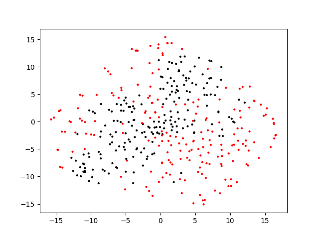
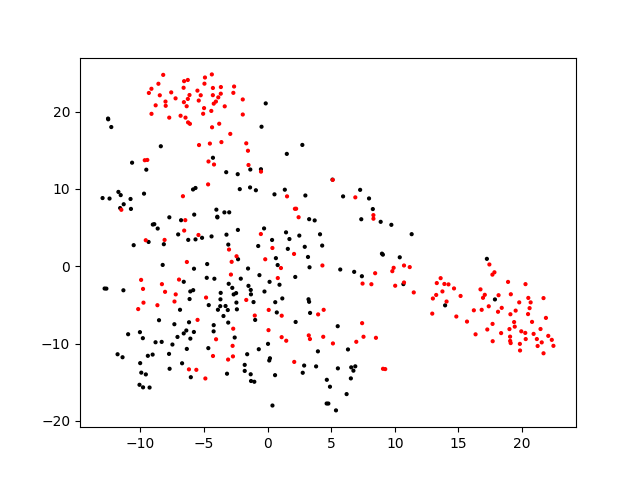

Implementation of two UDA models in PyTorch: DANN and ADDA. The models were used to implement transfer learning between MNISTM and SVHN datasets. 

DANN code adapted from: https://github.com/fungtion/DANN.

ADDA code adapted from: https://github.com/corenel/pytorch-adda.

t-SNE visualization of the DANN model output, where the two colours indicate whether that image came from the source/target domain:

t-SNE visualization of the ADDA model output, where the two colours indicate whether that image came from the source/target domain:

